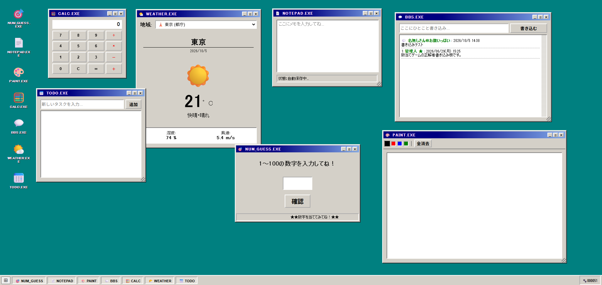

# Retro Desktop

昔のデスクトップOSをイメージした、ブラウザ上で操作できるWebアプリです。

[デモサイトを見る](https://app01.akiyo-fukuhara.work)

## 概要

JavaScriptの学習を兼ねて、複数のミニアプリをデスクトップ風の画面にまとめました。

アイコンやタスクバーからアプリを起動し、ウィンドウを操作できます。

## 主な機能

- 数当てゲーム
- ペイント
- 掲示板
- メモ帳
- 電卓
- 天気
- ToDoリスト作成
- ウィンドウの移動・最小化・最大化・閉じる動作
- ペイントのタッチ操作

## 使用技術

- HTML
- CSS
- JavaScript
- PHP
- ローカル開発環境：Local
- PHP：8.2.30

## 実装で工夫したこと

- 複数のウィンドウを同時に開けるようにしました
- 操作中のウィンドウが前面に表示されるようにしました
- ペイントでスマートフォンから指で描けるようにしました
- 数当てゲームの入力値を検証し、結果に応じた案内を表示しました

## 操作方法

1. デスクトップのアイコン、または画面下のタスクバーからアプリを開きます
2. ウィンドウ上部のボタンで最小化・最大化・終了できます
3. ペイントでは色を選んでキャンバス上に描画できます

## ローカルでの確認方法

1. Localで新しいサイトを作成します
2. サイトの公開フォルダに、このリポジトリのファイルを配置します
3. Localでサイトを起動し、表示されたローカルURLを開きます

※このアプリはWordPressを使用していません

## データ保存

BBSの投稿は‘save_log.php’で受け取り、‘bbs_log.txt’に保存しています。
ローカルで動かす場合は、PHPからこのファイルに書き込める状態にしてください。